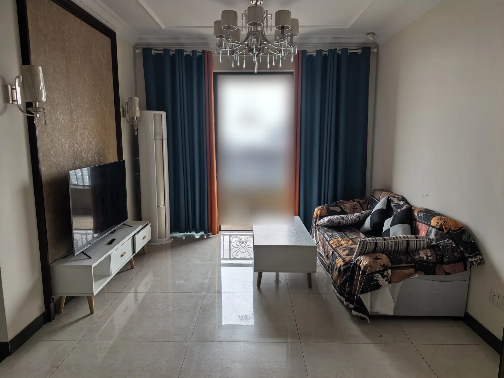

# Zhuyan AI

Zhuyan AI is a secure AI-powered interior furnishing desktop app. Upload a room photo and a rights-cleared style reference to visualize new layouts and décor while preserving the original room as the spatial source of truth. Compare immutable versions, refine designs, create editable furnishing lists, and search for visually similar products.

## Visual demo

| Original room | AI visualization — warm white and natural wood |
| --- | --- |
|  |  |

This example uses a user-authorized room photograph. The AI visualization applies a warm-white, natural-wood and rental-friendly furnishing direction while using the original photograph as the spatial reference. A follow-up immutable version removed an unwanted balcony hook without overwriting the first result. The demonstration images are not licensed under MIT; see [MEDIA-LICENSE.md](MEDIA-LICENSE.md).

> Demonstration result. AI-generated output may vary. Visualizations are furnishing concepts—not construction drawings, exact measurements, product guarantees, or proof of completed renovation.

## How it works

1. Add a room photograph as the spatial source of truth.
2. Choose a curated style or provide a rights-cleared reference image.
3. Generate a new immutable design version.
4. Compare the original and generated versions, then request focused revisions.
5. Build an editable furnishing list and search supported marketplaces for visually similar products.

## Repository layout

- `zhuyan-ai-desktop/` — Electron, React, TypeScript and Vite desktop application (`0.10.4`).
- `pi-soft-furnish-agent/` — restricted Pi business runtime and soft-furnishing tools (`0.8.2`).
- `scripts/` — portable Windows and macOS internal build helpers.

## Development

Requirements:

- Node.js `>=22.19.0`
- npm
- Windows x64 for the Windows installer
- Apple Silicon macOS for the arm64 DMG

```powershell
cd zhuyan-ai-desktop
npm ci --ignore-scripts
npm run build
npm run prepare:packaging

# Electron must be installed with its platform binary before running the UI.
npm rebuild electron
npm run dev
```

AI provider credentials are configured in the desktop application. Never place API keys in source files, `.env` files, Renderer variables, project metadata, logs, issues or release artifacts.

## Privacy, providers and cost

Zhuyan AI is local-first and does not include a hosted AI service. Room images, authorized reference images and request instructions are sent directly to the OpenAI-compatible provider configured by the user only when the user starts an applicable AI operation. The provider's terms, retention policy and charges apply. Use HTTPS: an HTTP provider exposes API credentials and image content to the network path.

The source release does not include product analytics, advertising trackers or a Zhuyan AI telemetry server. Projects and generated versions remain on the device unless the user copies or synchronizes them. See [PRIVACY.md](PRIVACY.md) for storage, network and deletion details.

## Security

Please report suspected vulnerabilities privately as described in [SECURITY.md](SECURITY.md). Do not place credentials, private room photographs, reference libraries or project data in public issues.

## Release safety

Release builds require a private rights-restricted reference image root or an approved hash-only manifest through environment variables. Private reference libraries, user projects, provider credentials, audit inputs, unapproved generated images and installers are excluded from Git. Only explicitly authorized, metadata-sanitized demonstration media may be tracked under `docs/images/`.

The current source version is Desktop `0.10.4` with Pi Soft Furnish Runtime `0.8.2`. Existing Windows and macOS packages are internal test builds, not public download releases. Public binary distribution still requires production icons, trusted code signing, Apple notarization where applicable, and clean-machine acceptance testing.

See [`zhuyan-ai-desktop/README.md`](zhuyan-ai-desktop/README.md), [`pi-soft-furnish-agent/README.md`](pi-soft-furnish-agent/README.md), [CHANGELOG.md](CHANGELOG.md), [CONTRIBUTING.md](CONTRIBUTING.md), [PRIVACY.md](PRIVACY.md), [SECURITY.md](SECURITY.md) and [MEDIA-LICENSE.md](MEDIA-LICENSE.md) for architecture, usage and project policies.

## License

MIT — see [`LICENSE`](LICENSE).
